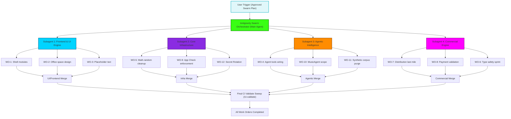

# Swarm Execution Macro Flowchart

This diagram outlines the parallel swarm architecture deployed to execute Production Work Orders 1 through 12 across four isolated but coordinated subagent domains.

## Transition Breakdown
1. **Trigger:** User has approved the massive multi-work-order execution via `implementation_plan.md`.
2. **Orchestration:** The main agent (Antigravity) dispatches four isolated subagents concurrently.
3. **Execution (Parallel):** Each subagent operates on its assigned domain, implementing features, fixing types, and addressing security concerns as outlined in `docs/PRODUCTION_WORK_ORDER.md`.
4. **Synchronization:** As each agent finishes, it marks its completion in the main `task.md`.
5. **Finalization:** Once all four subagents are complete, a final `/ci-validate` sweep ensures the codebase compiles, passes linting, and that no merge conflicts broke dependent modules.
