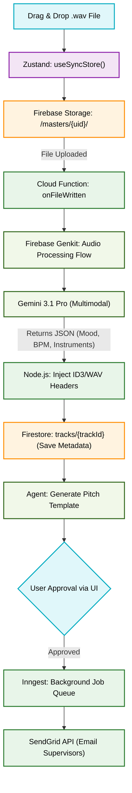

# AI-Powered Sync Tagger & Pitch Agent Flowchart

This flowchart visualizes the `indii` automated sync pipeline. It maps the transition from a master audio upload, through Gemini's multimodal processing via Firebase Genkit, into final ID3 metadata tagging and background email dispatch.

## Transition Breakdown
1. **Trigger:** The artist drops a `.wav` file into the React UI, uploading it directly to a secure Firebase Storage bucket.
2. **AI Analysis:** The upload triggers a Firebase Cloud Function running Genkit. Genkit passes the audio buffer to the Gemini 3.1 Pro multimodal model, instructing it to output a strict JSON schema containing emotional intent, BPM, genres, and specific instrumentation.
3. **Metadata Injection:** A Node layer uses a utility to physically write the returned JSON metadata into the `.wav` ID3 headers. This makes the file inherently searchable by music supervisors on any platform.
4. **Agent Handoff:** The data saves to Firestore, triggering an AI Agent to draft a contextual pitch email for micro-sync libraries.
5. **Execution:** Once the artist clicks "Approve", the payload is handed to Inngest for reliable, queued background delivery via SendGrid.
