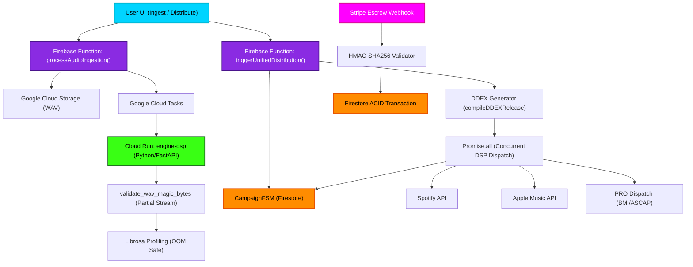

# System Architecture & Integration Refactor

This flowchart maps the unified backend architecture implemented during the transition from fragmented 3rd-party services to native Cloud Run/Firebase integration. It covers DSP ingestion, FSM orchestration, and DDEX pipelines.

## Transition Breakdown

1. **Ingestion Flow**: The user uploads an audio asset. The `processAudioIngestion` Cloud Function securely queues the GCS path onto Cloud Tasks. The Python `engine-dsp` Cloud Run service retrieves the task, performs a memory-safe 12-byte stream to validate magic bytes (WAV/RIFF), and then runs `librosa` profiling.
2. **Distribution Flow**: The `triggerUnifiedDistribution` Cloud Function activates the `CampaignFSM` to `DISTRIBUTING`. It generates an ERN 4.2 DDEX payload via `compileDDEXRelease()`. Instead of sequential external calls, it fires `Promise.all()` to dispatch to Spotify, Apple Music, Tidal, and PROs concurrently, wrapped with an Exponential Backoff Circuit Breaker.
3. **Escrow Webhooks**: The `/escrow` webhook receives events from Stripe, validates the payload integrity using `crypto.createHmac`, and performs an ACID transaction against Firestore's `escrows` collection to prevent double-spending or replay attacks before releasing funds.
