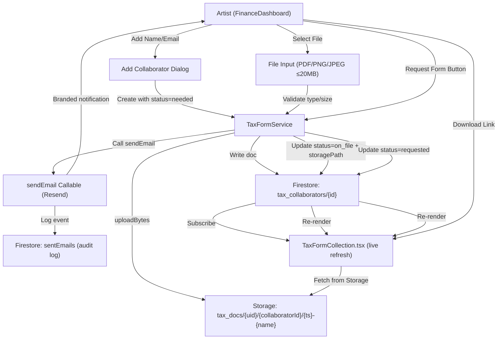
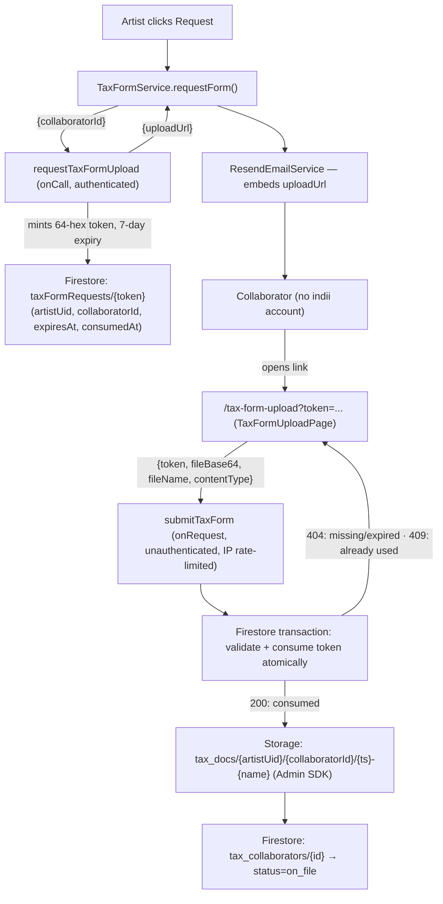

# Tax Form Collection — Architecture (Phase 1 + Phase 2)

## Overview
Real tax form collection. Phase 1: artist-side upload + email request. Phase 2 (shipped same session): collaborator self-serve single-use token upload link — the collaborator has no indii account, so this link is the entire mechanism by which they submit a form.

## Data Flow



## Security Boundaries

### Storage Rules (`storage.rules`)
- **New path:** `match /tax_docs/{userId}/{collaboratorId}/{fileName}`
  - Owner-only: `allow read/create/delete if isAuthenticated() && request.auth.uid == userId`
  - Content type: PDF, PNG, JPEG only
  - Size limit: ≤ 20MB
  - Versioning: no update, only create/delete (forces new filename for replacements)

### Firestore Rules (`firestore.rules`)
- Path: `users/{uid}/tax_collaborators/{id}`
- Owner-only read/write (standard pattern under `users/{uid}` subtree)
- Schema validation: `{name, email, country, formType, status, uploadedAt?, storagePath?, fileName?, sizeBytes?, requestedAt?}`

## Status Machine

```
needed → [upload] → on_file
       ↓
   requested ← [request email] → [email bounces: stays requested]

on_file → [manual mark] → reviewed (artist action only)
```

**No auto-transitions.** No "Verified" — that's IRS e-services, not our scope.

## Component State

- Subscribe to `Firestore.onSnapshot(users/{uid}/tax_collaborators)`
- Local state: `sentNotifs` → removed (no fake checkmarks)
- Error display: honest messages from upload/email failures
- Download: `CloudStorageService.getDownloadURL()` for owner-only URLs

## Implementation Files

| File | Purpose |
|------|---------|
| `packages/renderer/src/services/finance/TaxFormService.ts` | NEW — add/upload/request logic |
| `packages/renderer/src/modules/finance/components/TaxFormCollection.tsx` | Rewrite to use real service |
| `packages/firebase/storage.rules` | NEW `tax_docs` path + rules |
| `packages/firebase/firestore.rules` | Add `tax_collaborators` path validation (if not covered by wildcard) |
| `packages/renderer/src/services/finance/TaxFormService.test.ts` | NEW — unit tests for all paths |
| `packages/renderer/src/modules/finance/components/TaxFormCollection.test.tsx` | NEW — component tests |

## Acceptance Criteria (Phase 1)

✅ = Required for FIXED status

1. **Storage Rules Deployed**
   - ✅ `tax_docs/{userId}/{collaboratorId}` path exists, owner-only
   - ✅ Content type restricted to PDF/PNG/JPEG
   - ✅ Size limit 20MB enforced
   - ✅ No update allowed (force versioning)

2. **Firestore Records Real**
   - ✅ Add collaborator writes to `users/{uid}/tax_collaborators/{id}`
   - ✅ Status transitions tracked: needed → on_file/requested → reviewed
   - ✅ Storage paths and metadata stored (fileName, sizeBytes, uploadedAt)

3. **Upload Path End-to-End**
   - ✅ File input accepts PDF/PNG/JPEG only
   - ✅ Client-side validation: type + size before upload
   - ✅ `uploadBytes` to Storage succeeds
   - ✅ Firestore doc updated with `{storagePath, fileName, sizeBytes, uploadedAt}`
   - ✅ Page refresh: data persists (proves Firestore subscription)
   - ✅ On failure: honest error displayed, no fake success

4. **Email Request Path**
   - ✅ Request button invokes `sendEmail` callable
   - ✅ Email lands in collaborator inbox (Resend audit log proves send)
   - ✅ Status updated to `requested` on success
   - ✅ On failure: honest error, not silently swallowed

5. **Download (Owner-Only)**
   - ✅ Download link only for owner (verify via `getDownloadURL`)
   - ✅ Signature-verified Storage URL returned

6. **Code Quality**
   - ✅ `npm run typecheck` clean for new/touched files
   - ✅ `npm run lint` clean
   - ✅ Unit tests for: upload path, email request, rejection paths
   - ✅ Component tests for: collaborator add, upload UI, error display

---

## Not in Phase 1

- ~~Phase 2 collaborator self-serve link~~ — shipped, see below.
- Desktop (Electron) verification (requires ISSUE-677 App Check resolution)
- IRS TIN verification (out of scope)
- Automatic status → "Verified" (manual only)

---

## Phase 2 — Collaborator Self-Serve Token Link

### Architecture



### The real finding: auth bypass required a new route class

`STANDALONE_MODULES` (`core/constants.ts`) only hides chrome for **already-authenticated** users — `App.tsx` routes every unauthenticated visitor to `<LoginForm />` before the module system is ever reached. A collaborator with no indii account would hit a login wall for an account that can't exist.

Fix: added `isTaxFormUploadPage` in `App.tsx`, checked *before* the `!user` gate — the same treatment as the pre-existing `publicLegalPage` branch (privacy/terms), the only other route in the app that bypasses login. This is now the documented pattern for any future public, unauthenticated page.

### Security model

- **Token is the entire auth boundary** for `submitTaxForm` — no Firebase Auth involved, by design (the collaborator has none). 64 hex chars, single-use, 7-day expiry, consumed atomically inside a Firestore transaction to close the race between two simultaneous submissions.
- **`taxFormRequests/{token}` denies all client access** (`allow read, write: if false`) — only the Admin SDK inside `submitTaxForm` ever touches it.
- **`requestTaxFormUpload` scopes the mint to the caller's own uid path** (`users/{uid}/tax_collaborators/{collaboratorId}`) — an artist cannot mint a link for another artist's collaborator.
- Storage rules (`tax_docs/**`) stay unchanged from Phase 1 — the collaborator's bytes reach Storage only via the Admin SDK inside `submitTaxForm`, never a direct client write.

### Verification

Emulator-validated rules, `packages/firebase && npm run build` clean, 44 unit/component tests (12 new for Phase 2: 4 `requestTaxFormUpload`, 8 `submitTaxForm`, 6 `TaxFormUploadPage`, plus 2 rewritten `TaxFormService.requestForm` cases asserting the link is embedded in the email). No live-cloud round-trip in this environment (no Firebase credentials in this sandbox's `.env`) — recommend one live pass after deploy.

## Transition Breakdown

1. The artist creates an owner-scoped collaborator record; the live Firestore subscription makes that durable record the UI source of truth.
2. An artist-side upload validates PDF/image type and size, stores the object under the owner's `tax_docs` path, and advances the collaborator record only after Storage succeeds.
3. A request action invokes the authenticated callable, which verifies ownership, creates a single-use expiring token, and sends the collaborator a public upload link.
4. The signed-out collaborator opens the pre-auth route and submits the token plus validated file bytes to the rate-limited HTTP function.
5. A Firestore transaction rejects missing, expired, or consumed tokens and atomically consumes a valid token before the Admin SDK stores the document and marks the collaborator `on_file`.
6. Owner-only download and deletion remain separate artist actions; neither request delivery nor collaborator upload implies IRS verification.
