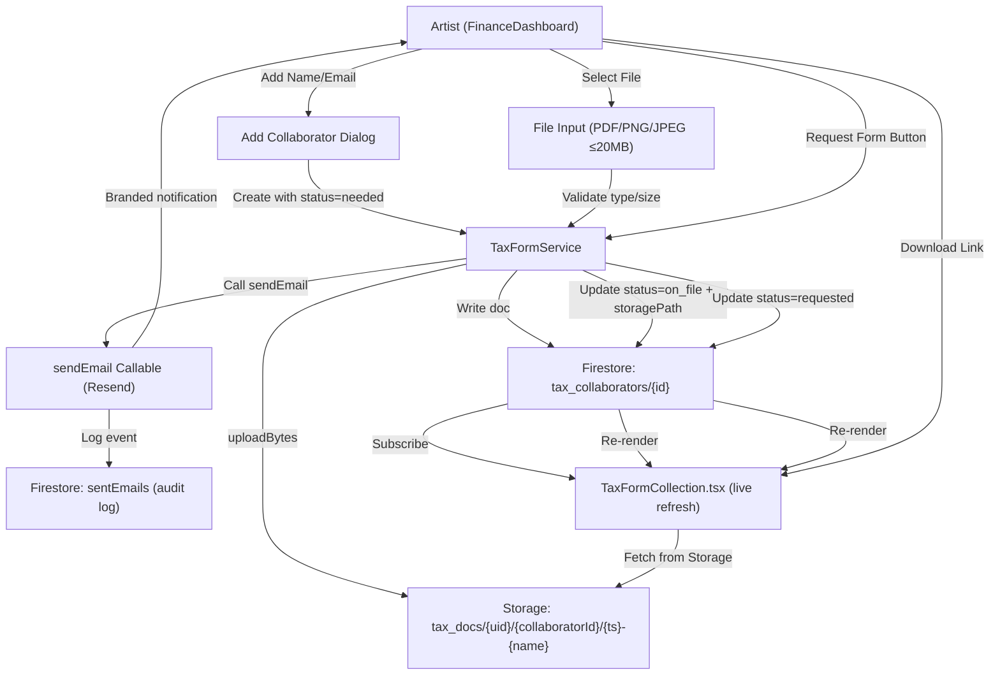

# Tax Form Collection — Phase 1 Architecture

## Overview
Real tax form collection via artist-side upload + email request. No Phase 2 (self-serve collaborator link) in this ship.

## Data Flow



## Security Boundaries

### Storage Rules (`storage.rules`)
- **New path:** `match /tax_docs/{userId}/{collaboratorId}/{fileName}`
  - Owner-only: `allow read/create/delete if isAuthenticated() && request.auth.uid == userId`
  - Content type: PDF, PNG, JPEG only
  - Size limit: ≤ 20MB
  - Versioning: no update, only create/delete (forces new filename for replacements)

### Firestore Rules (`firestore.rules`)
- Path: `users/{uid}/tax_collaborators/{id}`
- Owner-only read/write (standard pattern under `users/{uid}` subtree)
- Schema validation: `{name, email, country, formType, status, uploadedAt?, storagePath?, fileName?, sizeBytes?, requestedAt?}`

## Status Machine

```
needed → [upload] → on_file
       ↓
   requested ← [request email] → [email bounces: stays requested]

on_file → [manual mark] → reviewed (artist action only)
```

**No auto-transitions.** No "Verified" — that's IRS e-services, not our scope.

## Component State

- Subscribe to `Firestore.onSnapshot(users/{uid}/tax_collaborators)`
- Local state: `sentNotifs` → removed (no fake checkmarks)
- Error display: honest messages from upload/email failures
- Download: `CloudStorageService.getDownloadURL()` for owner-only URLs

## Implementation Files

| File | Purpose |
|------|---------|
| `packages/renderer/src/services/finance/TaxFormService.ts` | NEW — add/upload/request logic |
| `packages/renderer/src/modules/finance/components/TaxFormCollection.tsx` | Rewrite to use real service |
| `packages/firebase/storage.rules` | NEW `tax_docs` path + rules |
| `packages/firebase/firestore.rules` | Add `tax_collaborators` path validation (if not covered by wildcard) |
| `packages/renderer/src/services/finance/TaxFormService.test.ts` | NEW — unit tests for all paths |
| `packages/renderer/src/modules/finance/components/TaxFormCollection.test.tsx` | NEW — component tests |

## Acceptance Criteria (Phase 1)

✅ = Required for FIXED status

1. **Storage Rules Deployed**
   - ✅ `tax_docs/{userId}/{collaboratorId}` path exists, owner-only
   - ✅ Content type restricted to PDF/PNG/JPEG
   - ✅ Size limit 20MB enforced
   - ✅ No update allowed (force versioning)

2. **Firestore Records Real**
   - ✅ Add collaborator writes to `users/{uid}/tax_collaborators/{id}`
   - ✅ Status transitions tracked: needed → on_file/requested → reviewed
   - ✅ Storage paths and metadata stored (fileName, sizeBytes, uploadedAt)

3. **Upload Path End-to-End**
   - ✅ File input accepts PDF/PNG/JPEG only
   - ✅ Client-side validation: type + size before upload
   - ✅ `uploadBytes` to Storage succeeds
   - ✅ Firestore doc updated with `{storagePath, fileName, sizeBytes, uploadedAt}`
   - ✅ Page refresh: data persists (proves Firestore subscription)
   - ✅ On failure: honest error displayed, no fake success

4. **Email Request Path**
   - ✅ Request button invokes `sendEmail` callable
   - ✅ Email lands in collaborator inbox (Resend audit log proves send)
   - ✅ Status updated to `requested` on success
   - ✅ On failure: honest error, not silently swallowed

5. **Download (Owner-Only)**
   - ✅ Download link only for owner (verify via `getDownloadURL`)
   - ✅ Signature-verified Storage URL returned

6. **Code Quality**
   - ✅ `npm run typecheck` clean for new/touched files
   - ✅ `npm run lint` clean
   - ✅ Unit tests for: upload path, email request, rejection paths
   - ✅ Component tests for: collaborator add, upload UI, error display

---

## Not in Phase 1

- Phase 2 collaborator self-serve link (separate ship)
- Desktop (Electron) verification (requires ISSUE-677 App Check resolution)
- IRS TIN verification (out of scope)
- Automatic status → "Verified" (manual only)
