# Thesis PDF Download Flowchart

This map covers the founder thesis viewer's static, same-origin PDF download path. The feature deliberately uses the browser's native download behavior and Vite's existing public-asset pipeline, with no new client runtime or backend service.

```mermaid
flowchart LR
    Viewer["User watches the thesis viewer"] --> Action["Download thesis control"]
    Action --> Link["Native anchor with download filename"]
    Link --> PublicAsset["packages/landing/public/downloads/the-indii-thesis.pdf"]
    Generator["scripts/generate-thesis-pdf.py"] --> Canonical["output/pdf/the-indii-thesis.pdf"]
    Generator --> PublicAsset
    PublicAsset --> Build["Vite landing production build"]
    Build --> ServedAsset["dist/downloads/the-indii-thesis.pdf"]
    ServedAsset --> Browser["Browser saves The-indii-Thesis.pdf"]
    Browser --> Verify["Playwright download and PDF validation"]

    style Viewer fill:#e0f7fa,stroke:#00acc1,stroke-width:2px
    style Action fill:#e0f7fa,stroke:#00acc1,stroke-width:2px
    style Link fill:#f3e5f5,stroke:#8e24aa,stroke-width:2px
    style Generator fill:#f3e5f5,stroke:#8e24aa,stroke-width:2px
    style Canonical fill:#fff3e0,stroke:#ff8f00,stroke-width:2px
    style PublicAsset fill:#fff3e0,stroke:#ff8f00,stroke-width:2px
    style Build fill:#e8f5e9,stroke:#2e7d32,stroke-width:2px
    style ServedAsset fill:#e8f5e9,stroke:#2e7d32,stroke-width:2px
    style Browser fill:#e0f7fa,stroke:#00acc1,stroke-width:2px
    style Verify fill:#fce4ec,stroke:#d81b60,stroke-width:2px
```

## Transition breakdown

1. `ThesisCrawl.tsx` renders a persistent download control inside the viewer HUD so it remains available during the introduction, title, crawl, pause, and closing states.
2. The control is a normal same-origin anchor. Its `href` targets `/downloads/the-indii-thesis.pdf`, and its `download` attribute supplies the stable filename `The-indii-Thesis.pdf` without JavaScript blob handling or a new dependency.
3. `scripts/generate-thesis-pdf.py` is the editable source for the PDF. One run writes the canonical artifact to `output/pdf/` and the byte-identical web asset to the landing package's `public/downloads/` directory.
4. The existing Vite build copies the public asset into `packages/landing/dist/downloads/`. Build output is the upload source used by the landing deployment, so the PDF follows the same release path and cache boundary as the site that exposes it.
5. PDF validation reopens the file, checks metadata/page count/text, renders every page to PNG, and visually inspects the pages for clipping, overflow, or broken typography.
6. Browser validation opens the founder thesis route, confirms the control at desktop and mobile widths, accepts the real download event, and verifies the saved filename, MIME type, and PDF header. Any failed build, missing file, bad HTTP response, or invalid download keeps the feature open.
