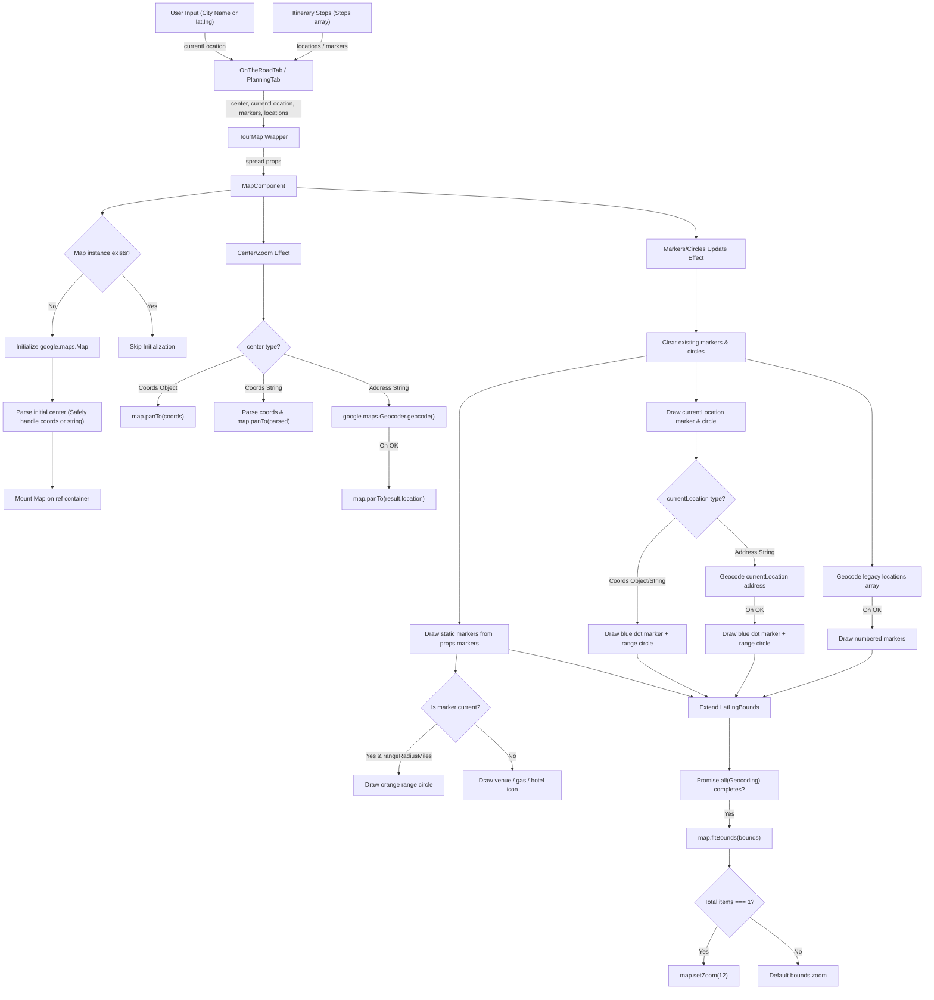

# Flowchart: Tour Map Integration (Micro Architecture)

Micro-architecture flow of user location inputs, stop selections, and quick action coordinates parsed and rendered dynamically inside the `TourMap` component.

## State Transitions & Lifecycles

### 1. Map Mount & Initialization
- **Ref Connection Check**: Verifies `ref.current.isConnected` before creating the map instance.
- **Sentinel Active Mounting Flag**: The `active` flag prevents setting map state or rendering markers on unmounted or disconnected DOM containers during fast tab switching.

### 2. Coordinate Resolution & Geocoding Pipeline
- **Sync Coordinate Extraction**: Regex-like coordinate split (`latitude, longitude`) resolves immediately, avoiding asynchronous network latency for GPS queries.
- **Async Geocoding Fallback**: Addresses like `"Austin, TX"` trigger `google.maps.Geocoder.geocode()`. On callback, the results extend the bounds map view asynchronously.

### 3. Cleanup Routine
- Executed on component unmount:
  - Detaches all marker listeners: `google.maps.event.clearInstanceListeners(marker)`
  - Detaches all circle listeners: `google.maps.event.clearInstanceListeners(circle)`
  - Removes overlays from the map canvas: `marker.setMap(null)` and `circle.setMap(null)`
