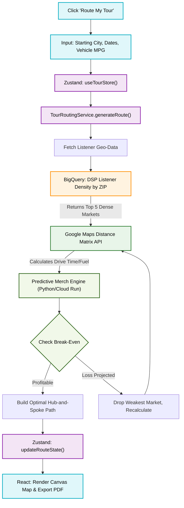

# Algorithmic Tour Router & Merch Forecaster Flowchart

This diagram outlines the micro-architecture of the `indii` Tour Router. It maps how user inputs on the frontend combine with DSP listener data from BigQuery and the Google Maps API to generate a profitable, hub-and-spoke tour route.

## Transition Breakdown
1. **User Action:** The artist sets the baseline constraints (start city, timeline, vehicle fuel efficiency) via the React UI.
2. **Data Aggregation:** `TourRoutingService` queries BigQuery, which holds normalized listener demographic data from Spotify/Apple, finding the highest concentration of fans within a 300-500 mile radius.
3. **Logistics & AI:** The Google Maps Distance Matrix API calculates optimal driving routes and fuel costs. The Cloud Run predictive engine then models expected merch sales based on historic conversion rates in those specific ZIP codes.
4. **Self-Healing Loop:** If the algorithm detects a net financial loss, it automatically drops the lowest-performing city and re-runs the route until a profitable Hub-and-Spoke model is established.
5. **Resolution:** The validated route updates the Zustand state, rendering the interactive map on the canvas.
