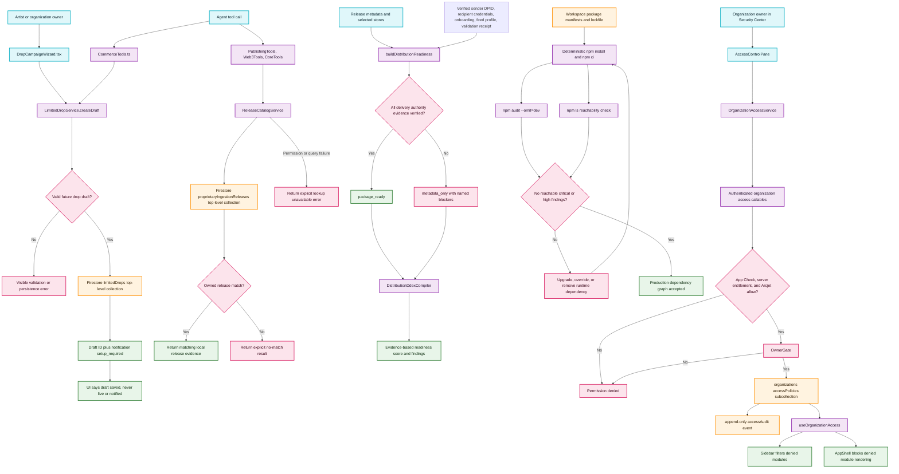

# Truthful Commerce, Distribution, and Security Remediation

This map defines the runtime truth boundaries for limited drops, release lookup, DDEX readiness, production dependencies, and organization access control. A customer-facing success or readiness state is emitted only after its corresponding persisted or verified evidence exists.

## Transition breakdown

1. The limited-drop form and commerce agent both submit the same strict draft input to `LimitedDropService`. The service validates product IDs, a non-empty name, and a future timestamp before writing one owner-scoped document to the top-level `limitedDrops` collection.
2. The persisted drop returns its Firestore ID and an explicit `setup_required` notification status. Until a notification provider and consent-aware fan job exist, neither the UI nor the agent may call the drop live or claim that fans were queued or notified.
3. Publishing, Web3, and calendar tools query the owner’s documents from the canonical top-level `proprietaryIngestionReleases` collection. They normalize the supported historical shapes in memory and distinguish a genuine no-match from a permission or database failure.
4. DDEX package readiness starts with typed release metadata but remains `metadata_only` until the sender DPID is verified and every selected recipient has verified onboarding, active credentials, a feed profile, and an accepted validation receipt. Each missing item becomes a named blocker.
5. Dependency repair removes build-only Electron tooling from runtime workspaces, upgrades or constrains vulnerable reachable packages, regenerates the lockfile, and repeats deterministic install, audit, and dependency-tree checks until the production critical/high gate passes.
6. The Access Control pane loads organization member UIDs and policies through callables protected by authentication, App Check, a server-owned entitlement, and Arcjet. It deliberately does not hydrate arbitrary member UIDs from user profiles, preventing the endpoint from becoming a UID-to-email directory. Only the organization owner can change member role or module permissions; the server validates the fixed permission schema and atomically stores both the policy and an append-only audit event.
7. The same access policy is consumed by both navigation and module rendering. Hiding denied navigation is convenience; the AppShell gate is the enforcement boundary that prevents direct module selection from rendering a denied module.
8. Any persistence, authorization, or verification failure terminates at an explicit error state. No fallback converts missing evidence into success, readiness, delivery, or permission.
