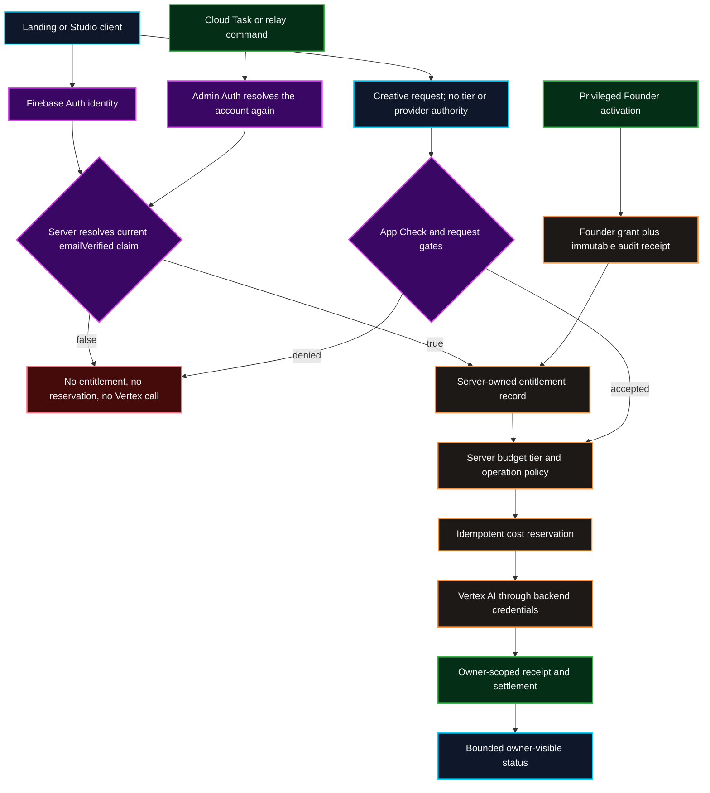

# Verified Entitlement Admission

This flowchart records the server-owned access and cost boundary for Free,
Founder, paid, and future BYO-API policies. A browser may request work, but it
never selects a tier, creates an entitlement, or authorizes Vertex spend.

## Transition Breakdown

1. The backend resolves the current Firebase Auth account and verified-email
   claim; browser profile fields cannot grant access.
2. A verified account receives or migrates its server-owned entitlement through
   a transaction that also writes an immutable grant receipt.
3. App Check and request policy must pass before the entitlement can authorize
   an idempotent cost reservation.
4. Only the backend reservation path may invoke Vertex AI with server
   credentials, and every outcome settles into an owner-scoped receipt.
5. Founder policy can remove product-credit limits but cannot bypass
   attestation, provider quota, idempotency, or emergency safety controls.
6. Queued and relayed work resolves Admin Auth and entitlement again before
   reserving cost, rather than trusting the original client request.

## Contract checks

1. The backend refreshes the Firebase Auth account before it resolves spend
   authorization. A cached browser profile, an email string, a custom request
   field, or local storage cannot grant a tier.
2. A verified account receives its Free entitlement through a backend
   transaction. The transaction can migrate a pre-existing Founder registry
   record and emits an immutable grant receipt.
3. Founder access removes product-credit limits only according to server policy;
   it does not bypass App Check, provider quota, idempotency, or emergency
   safety controls.
4. Queue and relay paths repeat the Admin Auth and entitlement resolution before
   they reserve cost or invoke Vertex, because their original browser token is
   not an authorization source.
5. `/users/{uid}` remains private because it carries identity and
   billing-adjacent fields. A future public artist directory must read a
   separately shaped public projection without email or entitlement data.
