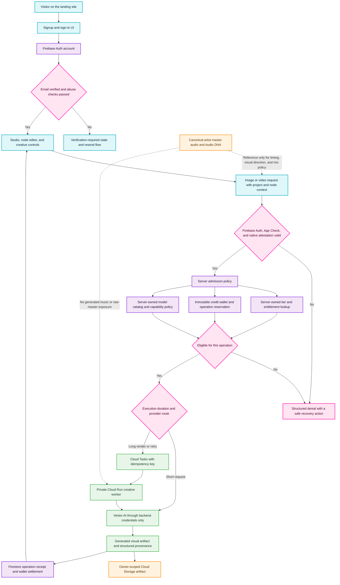

# Vertex Creative Admission and Credit Wallet Flowchart

This is the target runtime architecture for the first implementation sequence
approved on 2026-07-26. It deliberately separates verified facts about the
current codebase from controls that still need to be built. It preserves the
existing node editor, beat and section alignment, creative planning, and
canonical master-audio systems; it does not introduce music generation.

## Scope and current gaps

The present creative gateway already performs server-side cost reservations in
[`packages/firebase/src/functions/creative/gateway.ts`](../../packages/firebase/src/functions/creative/gateway.ts),
but admission is not yet a single authoritative policy boundary. In particular,
the landing signup flow writes a client-chosen free tier and redirects before
email verification, while [`appCheck.ts`](../../packages/firebase/src/middleware/appCheck.ts)
currently accepts a forgeable Electron header/user-agent bypass. The target
below replaces those gaps with server-authoritative identity, entitlement, and
credit decisions before a request can reach Vertex AI.

## Transition breakdown

1. **Account creation and verification.** The landing UI creates a Firebase
   Auth account and sends the verification email, but the backend—not the
   client document—must decide when a verified account receives a free-tier
   entitlement. The UI must remain in a verification-required state until that
   fact is true.
2. **Abuse-resistant client admission.** Every creative request carries normal
   Firebase authentication and platform attestation. A descriptive header or
   user-agent is never evidence of an Electron/native client. A failed check
   returns a structured error and does not reserve credits or enqueue work.
3. **Single server decision.** A new admission service resolves the
   authenticated account's server-owned tier, feature entitlement, model
   capability, rate/concurrency limits, and price from a versioned catalog.
   Clients may request an operation, but cannot select their tier, balance,
   provider, price, or execution policy.
4. **Credit reservation.** The server records an idempotent wallet reservation
   before work begins. Settlement, release, refunds, and top-ups become ledger
   events, never a mutable client balance. This replaces raw monthly video
   minutes with operation-aware Generation Credits while preserving the
   existing cost-reservation implementation as the migration starting point.
5. **Backend-only Vertex execution.** Short operations may call Vertex from a
   Firebase function; long-running, retryable work travels through Cloud Tasks
   to a private Cloud Run worker. Both paths use backend credentials and a
   server-owned model catalog. No Gemini/Vertex/API credential, provider route,
   or raw master-audio byte path is exposed to the browser.
6. **Artifact, receipt, and retry behavior.** Every operation stores an
   owner-scoped artifact reference plus a durable receipt containing the
   policy/catalog version, reservation ID, provider result classification, and
   settled or released wallet state. A retry reuses the idempotency key rather
   than purchasing the same work twice.
7. **Audio-to-visual boundary.** Canonical master audio may provide measured
   timing, Audio DNA, and an explicit mix policy for music-video workflows.
   It remains the artist's protected source asset; image/video systems create
   visuals only and never synthesize music.

## Failure classification and operator response

- **400-class input or policy errors:** reject before reservation when possible;
  otherwise release the reservation and return the validation field/code.
- **429/rate and capacity errors:** retain the idempotency key, apply bounded
  backoff through the queue where eligible, and show the real retry time or
  credit state. Do not hide the error behind a fake completed job.
- **Provider or storage failure:** classify the failure, preserve the receipt,
  release or retain the reservation only according to explicit settlement
  policy, and make retryability visible to the user.
- **Security failure:** deny without attempting a fallback to weaker client
  checks, alternate providers, or client-held API credentials.

## First runtime acceptance criteria

The first implementation slice is complete only when all of the following are
demonstrated with automated tests and a live-safe verification path:

1. A newly signed-up account cannot enter paid/free creative execution until
   its email is verified and server entitlement exists.
2. A forged Electron header or user-agent cannot bypass App Check/native
   attestation.
3. The server, not the browser, determines the tier, allowance, price,
   provider, and selected model.
4. A duplicate request with the same idempotency key creates no duplicate
   wallet debit or generation.
5. No browser bundle, network request, or persisted client state contains a
   Vertex/Gemini credential, a raw master-audio payload, or a mutable credit
   balance.
