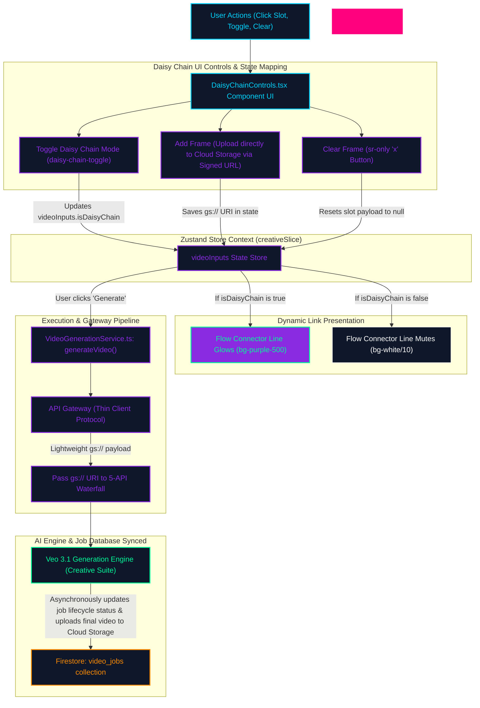

# Video Daisy Chain Composition Flowchart

This flowchart maps the interactive state, validation logic, normalisation phase, and generation path implemented inside the Video Producer's composition controls (`DaisyChainControls.tsx`). It outlines how starting/ending video frames and linking toggles coordinate with the Zustand creative slice and flow connector lines to supply normalised inputs to the Veo 3.1 generation engine.

---

## The Flowchart Diagram

---

## Detailed Step-by-Step Transition Breakdown

1. **User Interaction & Control Mapping:**
   - The user mounts the Video Producer's Daisy Chain controls UI.
   - The interface renders two spacious `64x32px` widescreen slot frames (`START` and `END`) that match the standard aspect ratio of landscape media assets, replacing legacy `32x32px` squares.
2. **State Updates inside Zustand Slice:**
   - **Adding Frame Assets:** Clicking a frame slot (`first-frame-slot` or `last-frame-slot`) invokes the image gallery picker or local system file explorer. The UI immediately uploads the file to Firebase Cloud Storage via a Signed URL, storing only the lightweight `gs://` URI in `videoInputs.firstFrame` or `videoInputs.lastFrame`.
   - **Clearing Frame Assets:** Clicking the overlay clear button (`X` icon) on a populated slot triggers `clearFrame()`, resetting the respective state slot to `null`. To ensure absolute alignment with Vitest automated test selectors checking for a literal `'×'` text content, a hidden screen-reader container (`×`) is embedded within the button markup.
   - **Toggling Daisy Chain:** Clicking the connection link icon updates `videoInputs.isDaisyChain` to `true` or `false`.
3. **Visual Link Presentation Logic:**
   - The connector path is structured as a dynamic thread of link lines surrounding a central direction indicator (`ArrowRight`).
   - If `isDaisyChain` is active, the linking line lights up as `bg-purple-500` (which satisfies the strict test assertions) and the arrow animates with a soft pulse.
   - If `isDaisyChain` is inactive, the line is rendered in a muted `bg-white/10` style, indicating decoupled frame blocks.
4. **Execution & Gateway Pipeline (`VideoGenerationService.ts`):**
   - When the user executes the video creation loop, `generateVideo()` is called.
   - The client bypasses memory-heavy Base64 normalization completely (Thin Client model). It simply wraps the lightweight `gs://` URIs in the request payload and passes them to the API Gateway.
5. **AI Delivery & Progress Sync:**
   - The Gateway routes the `first_frame` or `last_frame` Cloud Storage URIs to the Veo 3.1 Generation Engine (part of the 5-API Waterfall).
   - The engine asynchronously renders the video, saves the final output back to Cloud Storage, and updates the tracking job inside the Firestore `video_jobs` collection. The UI seamlessly binds to this collection to display real-time progress.
