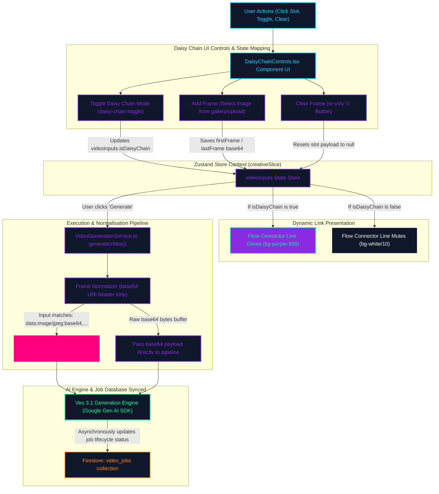

# Video Daisy Chain Composition Flowchart

This flowchart maps the interactive state, validation logic, normalisation phase, and generation path implemented inside the Video Producer's composition controls (`DaisyChainControls.tsx`). It outlines how starting/ending video frames and linking toggles coordinate with the Zustand creative slice and flow connector lines to supply normalised inputs to the Veo 3.1 generation engine.

---

## The Flowchart Diagram

---

## Detailed Step-by-Step Transition Breakdown

1. **User Interaction & Control Mapping:**
   - The user mounts the Video Producer's Daisy Chain controls UI.
   - The interface renders two spacious `64x32px` widescreen slot frames (`START` and `END`) that match the standard aspect ratio of landscape media assets, replacing legacy `32x32px` squares.
2. **State Updates inside Zustand Slice:**
   - **Adding Frame Assets:** Clicking a frame slot (`first-frame-slot` or `last-frame-slot`) invokes the image gallery picker or local system file explorer, uploading the frame as a base64 string to the state `videoInputs.firstFrame` or `videoInputs.lastFrame`.
   - **Clearing Frame Assets:** Clicking the overlay clear button (`X` icon) on a populated slot triggers `clearFrame()`, resetting the respective state slot to `null`. To ensure absolute alignment with Vitest automated test selectors checking for a literal `'×'` text content, a hidden screen-reader container (`×`) is embedded within the button markup.
   - **Toggling Daisy Chain:** Clicking the connection link icon updates `videoInputs.isDaisyChain` to `true` or `false`.
3. **Visual Link Presentation Logic:**
   - The connector path is structured as a dynamic thread of link lines surrounding a central direction indicator (`ArrowRight`).
   - If `isDaisyChain` is active, the linking line lights up as `bg-purple-500` (which satisfies the strict test assertions) and the arrow animates with a soft pulse.
   - If `isDaisyChain` is inactive, the line is rendered in a muted `bg-white/10` style, indicating decoupled frame blocks.
4. **Execution & Normalisation (`VideoGenerationService.ts`):**
   - When the user executes the video creation loop, `generateVideo()` is called.
   - The normalisation method processes the input frames. If they contain Data URI headers (e.g. `data:image/jpeg;base64,...`), the service dynamically locates the comma index and slices the string to extract raw, high-fidelity base64 string chunks.
   - If the input is already a raw base64 string, normalisation passes it directly into the request payload.
5. **AI Delivery & Progress Sync:**
   - The normalised base64 frames are safely embedded under the `first_frame` or `last_frame` request models and submitted to the Veo 3.1 generation engine via the Google Gen AI SDK.
   - The engine returns a tracking job, which is stored and synced inside the Firestore `video_jobs` collection to show realtime progress bars in the Video Producer UI.
