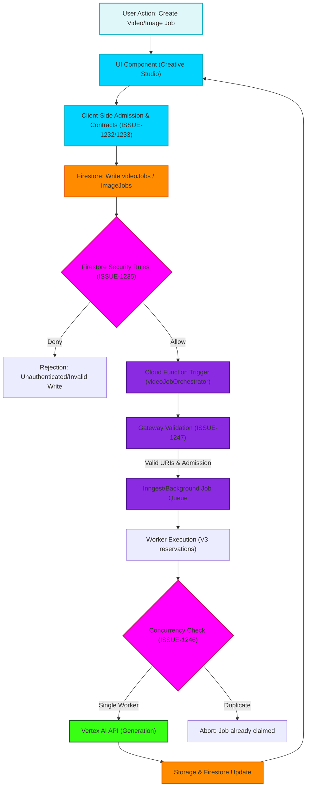

# Video Generation Validation Flowchart

This flowchart maps the high-level architecture and security boundaries for the Video Generation pipeline, specifically addressing the admission controls and validations required for ISSUE-1232, ISSUE-1233, ISSUE-1235, ISSUE-1246, and ISSUE-1247.

## Flow Transitions

1. **User Action to Client Validation**: The user initiates a video or image generation job from the UI. The client must adhere to the canonical generation admission contracts (ISSUE-1232, 1233), rejecting raw `clip.src` values and bypassing legacy callers.
2. **Firestore Rules Engine**: The client writes to `videoJobs` or `imageJobs`. Firestore security rules evaluate the write. It must reject unauthenticated writes, cross-owner writes, and direct execution without server admission (ISSUE-1235).
3. **Gateway Validation**: The Cloud Function triggers on the new job. The Gateway validates caller-supplied Cloud Storage URIs to ensure backend readability and security (ISSUE-1247).
4. **Concurrency Check**: Before executing the paid generation, the worker claims the job. V3 reservations ensure that if two workers pick up the same job, only one proceeds and settles the reservation, preventing duplicate execution (ISSUE-1246).
5. **Vertex AI Execution**: The validated and exclusively claimed job is sent to Vertex AI for generation. Output is persisted back to Storage/Firestore and reflected in the UI.
