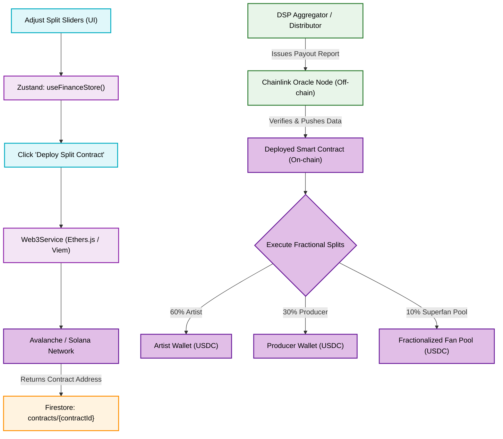

# Smart-Contract Splitter & Fractionalized Capital Flowchart

This flowchart outlines the integration of Web3 smart contracts within the `indii` ecosystem. It demonstrates how traditional DSP off-chain data bridges to on-chain environments via oracles to execute automated royalty splits in stablecoins.

## Transition Breakdown
1. **Configuration:** The artist sets visual splits in the React UI (e.g., 60% Artist, 30% Producer, 10% Fan Investor Pool). The Zustand store holds this configuration.
2. **Deployment:** The `Web3Service` compiles this data into a standard smart contract template and deploys it to a fast, low-fee chain (like Avalanche). The resulting contract address is saved in Firestore.
3. **The Oracle Bridge:** Because blockchains cannot directly read Spotify play counts, a Chainlink Oracle node acts as the bridge. When a traditional distributor (like TuneCore) issues a revenue statement, the Oracle verifies the data and pushes it to the smart contract.
4. **Execution:** Upon receiving verified payout data (and the corresponding capital transfer), the smart contract automatically executes the programmed splits, depositing USDC directly into the respective collaborator and fan wallets instantly.
