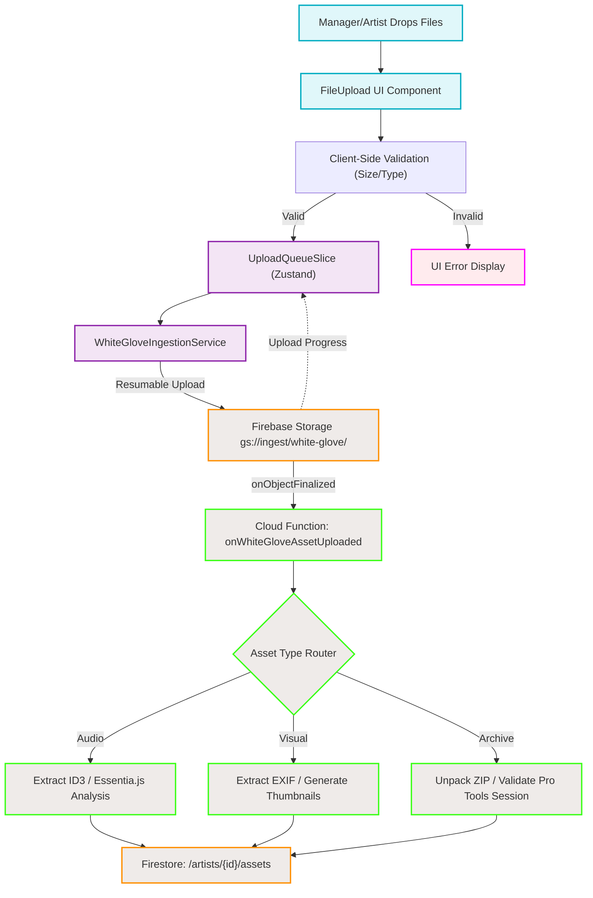

# White Glove Ingestion Flowchart

This diagram outlines the macro-level architecture of the White Glove Asset Ingestion System, tracing how massive artist assets move from the frontend UI into structured Firestore records via Firebase Storage and Cloud Functions.

## Transition Breakdown

1. **User Action to State Management:**
   - The user drags and drops a massive file (e.g., a 5GB Pro Tools ZIP) into the `FileUploadUI`.
   - The UI runs local client-side validation to ensure the file complies with our security formats.
   - Once validated, the item is pushed into the `UploadQueueSlice` in Zustand, setting its status to `pending`.

2. **Frontend Service Execution:**
   - The `WhiteGloveIngestionService` detects a new pending item in the queue.
   - It initializes a resumable upload task (`uploadBytesResumable`) to the Firebase Storage bucket.
   - It binds an `on` listener to the Firebase task, pumping real-time progress events back into the `UploadQueueSlice` (which natively updates the UI progress bars).

3. **Backend Trigger & Extraction:**
   - Once the file successfully finalizes in `gs://<bucket>/ingest/white-glove/<userId>`, Firebase automatically triggers the `onWhiteGloveAssetUploaded` Gen 2 Cloud Function.
   - The Cloud Function acts as an Asset Type Router. Depending on the MIME type and extension, it routes the file to a specialized worker.
   - Audio files get their metadata ripped out; visuals get compressed thumbnails generated; ZIP files get unrolled and structurally validated.

4. **Database Finalization:**
   - All extracted metadata, physical bucket paths, and associated artist IDs are constructed into a clean object and written to the Firestore `/artists/{userId}/assets` collection.
   - The UI (which can subscribe to this collection) will instantly reflect that the new asset has been successfully processed and is ready for use.
