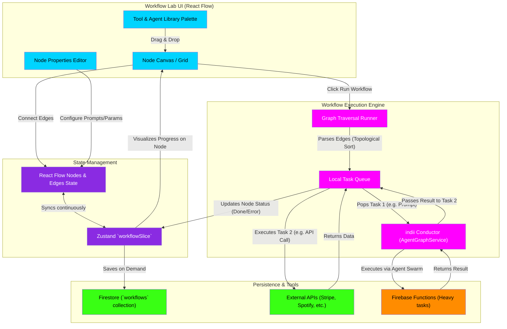

# Workflow Lab & Automation Flowchart

This flowchart maps the technical structure of the Workflow Lab in indii. It shows how the node-based visual editor (React Flow) constructs automation graphs, how those graphs are stored in Zustand and Firestore, and how the Execution Engine traverses the graph to run sequential AI and utility tasks.

## Transition Breakdown

1. **Graph Construction:** The user drags nodes from the **Tool & Agent Library Palette** onto the **Node Canvas**. They use the **Properties Panel** to configure specific prompts, input variables, or API keys.
2. **State Syncing:** Every interaction with the canvas (moving nodes, connecting edges) modifies the **React Flow State**, which is deeply integrated with the global **Zustand `workflowSlice`**. This ensures the visual graph maps exactly to the logical data structure.
3. **Persistence:** The user can save their automation recipe. The `workflowSlice` serializes the nodes and edges and saves them to the **Firestore** `workflows` collection for later retrieval.
4. **Execution Trigger:** When the user clicks "Run", the **Graph Traversal Runner** takes over. It performs a topological sort on the edges to determine the exact order of execution, ensuring dependencies (e.g., Node B needs Node A's output) are respected.
5. **Queue Processing:** The nodes are loaded into the **Local Task Queue**.
6. **Agent Handoff:** For AI tasks (like "Analyze Contract"), the runner sends the payload to the **indii Conductor**, which routes it to the appropriate specialist agent (or backend **Cloud Function** if it's heavy compute).
7. **Data Pipelining:** When the agent returns a result, the runner injects that output into the input parameters of the *next* node in the queue. 
8. **Live Feedback:** As each node finishes, the task queue updates the `workflowSlice`, which visually highlights the node on the **Canvas UI** (e.g., turning it green or showing an error icon) so the user can track the automation in real-time.
