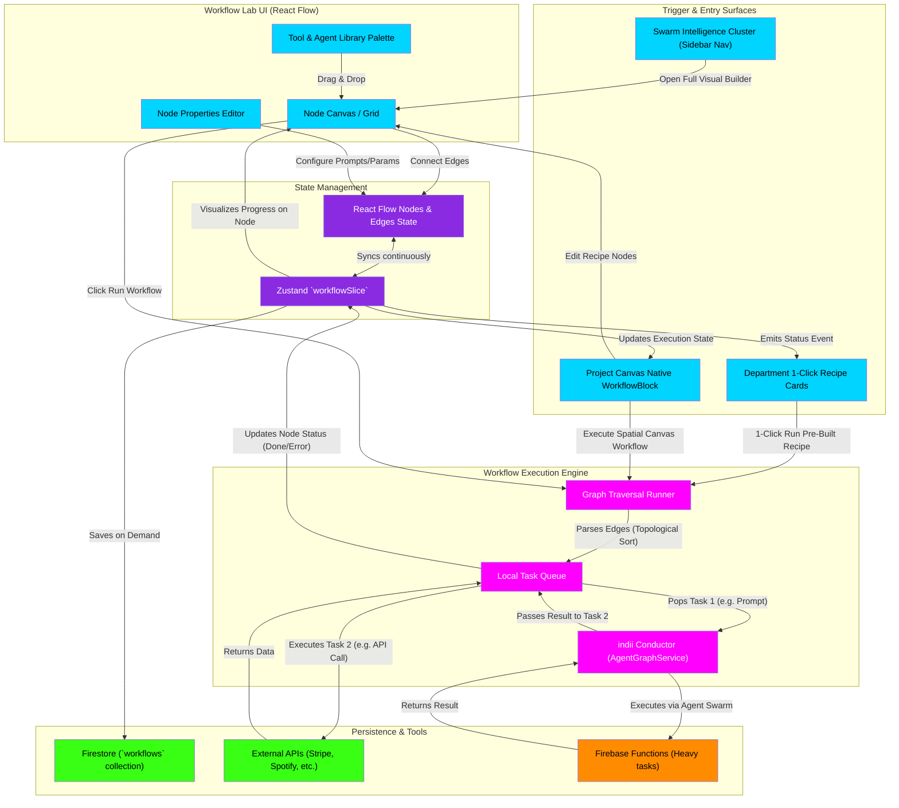

# Workflow Lab & Automation Flowchart

This flowchart maps the technical structure of the Workflow Lab in indii. Elevated to the top-level **"Swarm Intelligence & Automations"** cluster alongside the Boardroom and Agent Canvas, it details how the node-based visual editor (React Flow) constructs automation graphs, how individual departments trigger automations via 1-click recipe execution cards, how native `WorkflowBlock` elements integrate on the Project Canvas, and how the Execution Engine traverses the graph to run sequential AI and utility tasks.

## Step-by-Step Transition Breakdown

1. **Elevation & Multi-Surface Triggers:**
   - **Swarm Intelligence Cluster:** The Workflow Builder is elevated from the retired legacy tools drawer into the top-level **"Swarm Intelligence & Automations"** cluster in the sidebar, accessible alongside Boardroom, Agent Canvas, and Knowledge Base.
   - **Department 1-Click Recipe Cards:** Functional departments (Marketing, Distribution, Creative, Finance) expose tailored 1-click recipe cards (e.g., "Run Waterfall Release Campaign", "Batch Stem Analysis") that directly invoke pre-wired workflow graphs.
   - **Project Canvas Native WorkflowBlock:** On the Project Canvas, users can place native `WorkflowBlock` and `WorkflowRunBlock` nodes to visually chain workflows into spatial asset pipelines.
2. **Graph Construction:** Inside the visual builder, users drag nodes from the **Tool & Agent Library Palette** onto the **Node Canvas**. They use the **Properties Panel** to configure specific prompts, input variables, or API keys.
3. **State Syncing:** Every interaction with the canvas (moving nodes, connecting edges) modifies the **React Flow State**, which syncs with the global **Zustand `workflowSlice`**. This ensures the visual graph maps strictly to the underlying automation contract.
4. **Persistence:** Workflows are persisted on demand to the **Firestore** `workflows` collection, scoped to the authenticated owner and workspace.
5. **Execution Trigger & Topological Sorting:** When a run is triggered (from the builder, a department recipe card, or a canvas `WorkflowBlock`), the **Graph Traversal Runner** performs a topological sort on the edges to determine execution sequence, guaranteeing prerequisite data flow.
6. **Queue Processing & Agent Handoff:** Nodes enter the **Local Task Queue**. AI-driven prompts pass through the **indii Conductor** to the appropriate swarm specialist (or backend **Cloud Function** for heavy operations).
7. **Pipelining & Status Reflection:** Results from upstream nodes populate downstream node inputs. As each step resolves, the `workflowSlice` updates execution states across the active visual builder, the calling department recipe card, and any listening `WorkflowBlock` on the Project Canvas.
