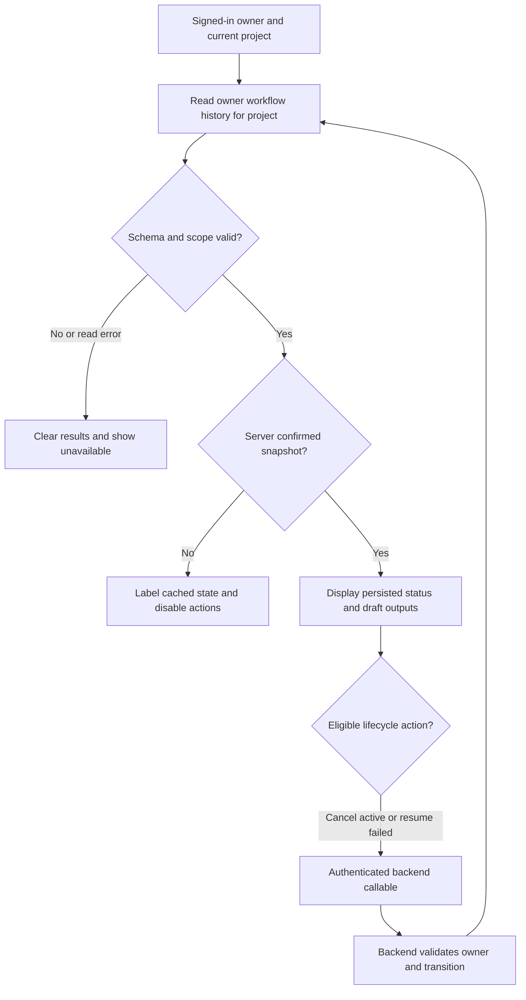

# Saved workflow results

## Transition Breakdown

History is bounded and explicitly partial above 50 records. Account or project changes remount the consumer. Neither a callable response nor a draft output manufactures completion or establishes live campaign launch.
