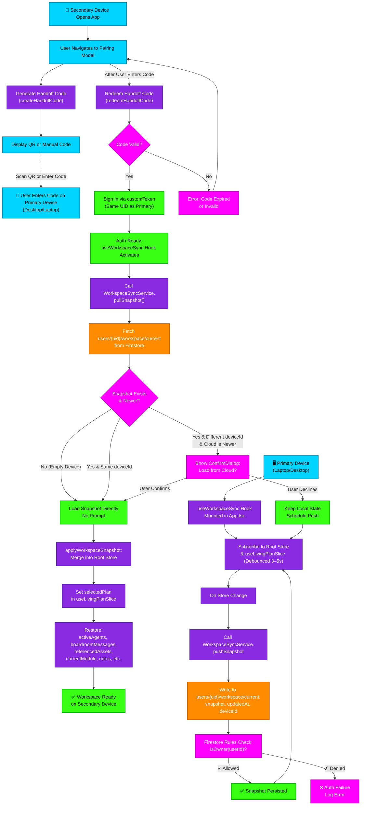

# Workspace Sync (Resume/Handoff) Flowchart

## Overview

This flowchart maps the cross-device workspace synchronization flow. When a device (iPad) enters a sync code to join a user's workspace, it:
1. Authenticates via the existing handoff code system (signs in as the same UID)
2. Pulls the last-saved workspace snapshot from Firestore (`users/{uid}/workspace/current`)
3. Applies last-write-wins (LWW) logic with a safety confirmation dialog
4. Rehydrates the local store with the remote snapshot
5. All devices continuously push snapshots to the cloud (debounced every 3–5s)

**Phase:** Resume/Handoff (Laptop can be closed; cloud holds canonical snapshot. Phase 2 Live Mirror comes later.)

---

## Mermaid Flowchart



---

## Transition Breakdown

### Phase 1: Handoff Code Generation & Entry (User Workflow)

**Step 1A — Secondary Device Opens Pairing Modal**
- Device: iPad, unauth'd or no prior pairing
- Action: User navigates to Settings → Sync Device
- Trigger: `PairingModal` component renders
- Files: `packages/renderer/src/modules/mobile-remote/MobileRemote.tsx`

**Step 1B — Generate Handoff Code (via Backend)**
- API Call: `POST createHandoffCode` (Cloud Function)
- Input: `idToken` (current user's ID token)
- Backend: `packages/firebase/src/functions/auth/handoff.ts::createHandoffCode`
- Output: `{ code: "64-char hex string" }` (valid 5 minutes)
- Storage: Firestore `handoff_codes/{codeId}` with TTL
- Display: QR code or 64-char text box

**Step 1C — User Enters Code on Primary Device**
- Device: Laptop/Desktop (or manually from iPad if no QR scan)
- Action: User copies code from iPad screen or scans QR
- Location: Primary device's Settings → Link Device
- File: `packages/renderer/src/modules/mobile-remote/MobileRemote.tsx` (PairingModal handles both entry modes)

### Phase 2: Code Redemption & Authentication

**Step 2A — Redeem Handoff Code (Secondary Device)**
- API Call: `POST redeemHandoffCode({ code })`
- Backend: `packages/firebase/src/functions/auth/handoff.ts::redeemHandoffCode`
- Validation:
  - Code exists in Firestore
  - Code not expired
  - Code not already redeemed
- Output: `{ customToken }` (Firebase custom token, same UID as code issuer)
- Firestore Update: `handoff_codes/{codeId}` set `redeemedAt: serverTimestamp()` + TTL extension or immediate deletion

**Step 2B — Sign In via Custom Token (Secondary Device)**
- SDK: `signInWithCustomToken(auth, customToken)`
- Result: Secondary device now authenticated as **same UID** as primary device
- Auth State: `auth.currentUser` populated on iPad
- Side Effect: All Firestore queries now scoped to `users/{uid}/...`

**Step 2C — Trigger Auth Ready (Hook Activation)**
- Hook: `useWorkspaceSync` (mounted in `App.tsx`)
- Trigger: `useEffect(() => { if (auth.currentUser) activateRehydration() }, [auth.currentUser])`
- Proceed to **Phase 3: Pull & Rehydrate**

### Phase 3: Pull Workspace Snapshot (Last-Write-Wins)

**Step 3A — Fetch Cloud Snapshot**
- Service: `WorkspaceSyncService.pullSnapshot()`
- Firestore Query: `getDoc(users/{uid}/workspace/current)`
- Return: `{ snapshot, updatedAt, deviceId } | null`
- Guard: Skip if E2E mock is enabled (`isFirebaseE2EMockEnabled()`)

**Step 3B — Conflict Detection & Safety Prompt**

Three paths:

1. **Path A: No Snapshot in Cloud (Empty Device)**
   - Condition: `snapshot === null`
   - Action: Load nothing (device stays empty)
   - Reason: Honest empty state (no mock data)
   - File: `packages/renderer/src/hooks/useWorkspaceSync.ts`

2. **Path B: Snapshot Exists, Same Device (Self-Echo)**
   - Condition: `snapshot && snapshot.deviceId === getDeviceId()`
   - Action: Skip load (avoid re-applying own writes)
   - Reason: Prevent device from clobbering its own recent push
   - Device ID: Cached in `localStorage` under key `indii-device-id`

3. **Path C: Snapshot Exists, Different Device, Cloud is Newer (Conflict)**
   - Condition: `snapshot && deviceId !== getDeviceId() && updatedAt > lastLocalWriteTime`
   - Action: Show `ConfirmDialog.call({ message: 'A newer workspace from another device is available — load it?' })`
   - **If User Confirms:** Proceed to **Step 3C** (apply snapshot)
   - **If User Declines:** Keep local state, schedule a push (Step 3D)
   - Rationale: Prevent silently wiping unsaved work
   - UI Component: `ConfirmDialog` (CLAUDE.md standard; never `window.confirm`)
   - File: `packages/renderer/src/hooks/useWorkspaceSync.ts`

**Step 3D — Apply Snapshot (Root Store + Plan Store)**
- Function: `applyWorkspaceSnapshot(snapshot)`
- File: `packages/renderer/src/core/store/index.ts`
- Steps:
  1. Merge fields into root store: `setActiveAgents`, `setBoardroomMessages`, `setReferencedAssets`, `setCurrentModule`, `setConversationMode`, `setNotes`, `setSelectedNoteId`, `setCreativePrompt`
  2. Restore plan: `useLivingPlanSlice.getState().setPlan(snapshot.selectedPlan)` (separate store)
  3. Guard: Skip fields missing from older `snapshot.schemaVersion` (forward compat)
- Timing: Runs once after login/redeem, then queued if user declined conflict prompt

---

### Phase 4: Background Push (Continuous Sync)

**Step 4A — Hook Wiring in App.tsx**
- Location: `packages/renderer/src/core/App.tsx`
- Mount: `useWorkspaceSync()` at root level
- Subscribes to: root store + `useLivingPlanSlice` in parallel

**Step 4B — Debounced Store Subscription**
- Event: Any change to `(state, prevState) => state !== prevState`
- Debounce: 3–5 seconds (prevents thrashing on rapid edits)
- Guarding: Skip while unauthenticated or E2E mock enabled
- File: `packages/renderer/src/hooks/useWorkspaceSync.ts`

**Step 4C — Snapshot Creation**
- Function: `getWorkspaceSnapshot(state)`
- File: `packages/renderer/src/core/store/index.ts`
- Captures:
  ```typescript
  {
    schemaVersion: 1,
    boardroomMessages: state.boardroomMessages,
    activeAgents: state.activeAgents,  // from root store, OR fallback from boardroomSlice
    referencedAssets: state.referencedAssets,
    selectedPlan: useLivingPlanSlice.getState().selectedPlan,
    selectedPlanId: useLivingPlanSlice.getState().selectedPlanId,
    currentModule: state.currentModule,
    conversationMode: state.conversationMode,
    notes: state.notes,
    selectedNoteId: state.selectedNoteId,
    creativePrompt: state.creativePrompt,
  }
  ```
- Exclusions: `userProfile` (has its own sync channel), auth state (not workspace), timestamps (cloud adds these)

**Step 4D — Cloud Write**
- Service: `WorkspaceSyncService.pushSnapshot(snapshot)`
- File: `packages/renderer/src/services/sync/WorkspaceSyncService.ts`
- Firestore Write:
  ```typescript
  setDoc(
    doc(db, 'users', uid, 'workspace', 'current'),
    {
      snapshot,
      updatedAt: serverTimestamp(),
      deviceId: getDeviceId(),  // stable ID for this device
      appVersion: APP_VERSION,
    },
    { merge: true }
  )
  ```

**Step 4E — Security Rules Enforcement**
- File: `packages/firebase/firestore.rules`
- Rule: `match /users/{userId}/workspace/{docId} { allow read, write: if isOwner(userId); }`
- Validation: Firestore checks `isOwner` before accepting write
- Failure: `PermissionError` caught in service, logged, retry on next debounce

**Step 4F — Cycle (Loop)**
- After successful write, subscription remains active
- Next change to store triggers debounce timer again
- Primary and secondary devices both push continuously (last write wins)

---

## Data Model: `users/{uid}/workspace/current`

```typescript
interface WorkspaceDoc {
  snapshot: {
    schemaVersion: 1,
    boardroomMessages: A2AMessage[],
    activeAgents: string[],
    referencedAssets: ReferencedAsset[],
    selectedPlan: LivingPlan | null,
    selectedPlanId: string | null,
    currentModule: string,
    conversationMode: string,
    notes: Note[],
    selectedNoteId: string | null,
    creativePrompt: string,
  },
  updatedAt: Timestamp,      // server-set
  deviceId: string,           // "device-uuid-here"
  appVersion: string,         // "1.55.3"
}
```

---

## Files Involved

| File | Role |
| --- | --- |
| `packages/renderer/src/services/sync/WorkspaceSyncService.ts` | NEW: Cloud push/pull service (Firestore read/write) |
| `packages/renderer/src/hooks/useWorkspaceSync.ts` | NEW: Hook for mounting, debounce, conflict prompt |
| `packages/renderer/src/core/store/index.ts` | MODIFIED: `getWorkspaceSnapshot`, `applyWorkspaceSnapshot` selectors |
| `packages/renderer/src/core/App.tsx` | MODIFIED: Mount `useWorkspaceSync()` |
| `packages/renderer/src/modules/mobile-remote/MobileRemote.tsx` | MODIFIED: Trigger rehydrate after code redeem; add workspace-sync label |
| `packages/firebase/src/functions/auth/handoff.ts` | EXISTING: `createHandoffCode`, `redeemHandoffCode` (no changes) |
| `packages/firebase/firestore.rules` | MODIFIED: Add `users/{userId}/workspace/{docId}` rule |
| `packages/renderer/src/services/sync/WorkspaceSyncService.test.ts` | NEW: Vitest — push, pull, deviceId echo, LWW logic |

---

## Error Paths & Fallbacks

| Scenario | Behavior |
| --- | --- |
| Code expired | Error: "Code expired. Try again." → retry from step 1B |
| Redeem fails (network) | Retry prompt shown. Manual retry via Settings. |
| Pull fails (auth expired) | Skip load; device stays local. User re-authenticates. |
| Push fails (permission denied) | Log error, retry on next debounce. User notified if persistent. |
| Conflict (cloud newer) | Show ConfirmDialog; user chooses. If decline, push override follows. |
| Snapshot malformed | Guard field access; skip missing keys (forward compat). |
| Device ID collision | Extremely rare (UUID based). Graceful fallback: device treats as "other device." |

---

## Testing Strategy

**Unit Tests** (`npm test -- --run WorkspaceSyncService`):
- Push writes doc with correct schema
- Pull returns snapshot + metadata
- Device ID caching works (localStorage)
- Device echoes its own writes (deviceId match)
- Newer-cloud conflict detection triggers correctly

**Integration Test** (Two-browser manual):
1. Laptop: `electron-vite dev` → seat agent, open plan, send message
2. Verify Firestore doc: `users/{uid}/workspace/current` populated
3. Quit laptop app (simulate closed device)
4. iPad/Web: `npm run dev:web` in new profile, redeem sync code
5. Verify: workspace loads with same agents, plan, messages
6. Desk → iPad → Desk cycle: state persists across all transitions

**Rules Validation** (`firebase_validate_security_rules`):
- Non-owner UID denied read/write to `users/{other}/workspace/current`
- Owner UID can read/write own workspace doc

---

## Phase 2 Roadmap (Live Mirror — not in this build)

When cloud workspace doc is established (Phase 1 done), Phase 2 upgrades to:
- Swap one-shot `pullSnapshot()` for continuous `subscribe(onSnapshot)`
- Add presence heartbeat (reuse `DESKTOP_HEARTBEAT_STALE_MS` logic from RemoteRelayService)
- Move from snapshot LWW to field-level merge (avoid clobbering concurrent edits)
- Decide where agents execute in a live multi-device session
- Handle device disconnect / reconnect seamlessly
