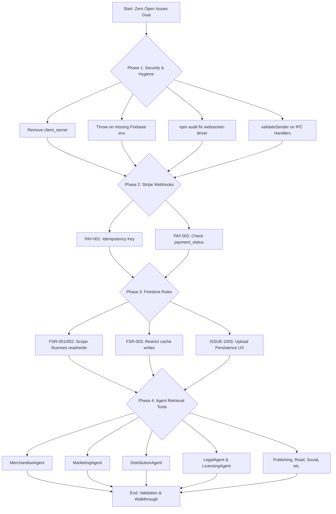

# Zero Open Issues Execution Strategy

This flowchart maps the high-level sequence of operations for closing out the remainder of `OPEN_ISSUES.md`.

## Step-by-Step Transition Breakdown
- **Phase 1 to Phase 2:** Security adjustments must compile and pass initial security validation gates before Stripe webhooks are refactored.
- **Phase 2 to Phase 3:** Ensure payment states resolve correctly in tests before adjusting access control definitions on Firestore.
- **Phase 3 to Phase 4:** Solidify database constraints and data safety layers prior to extending Retrieval tools config across all departments.
- **Phase 4 to End:** Verify all agents can boot and read domain resources, concluding with final tests.
