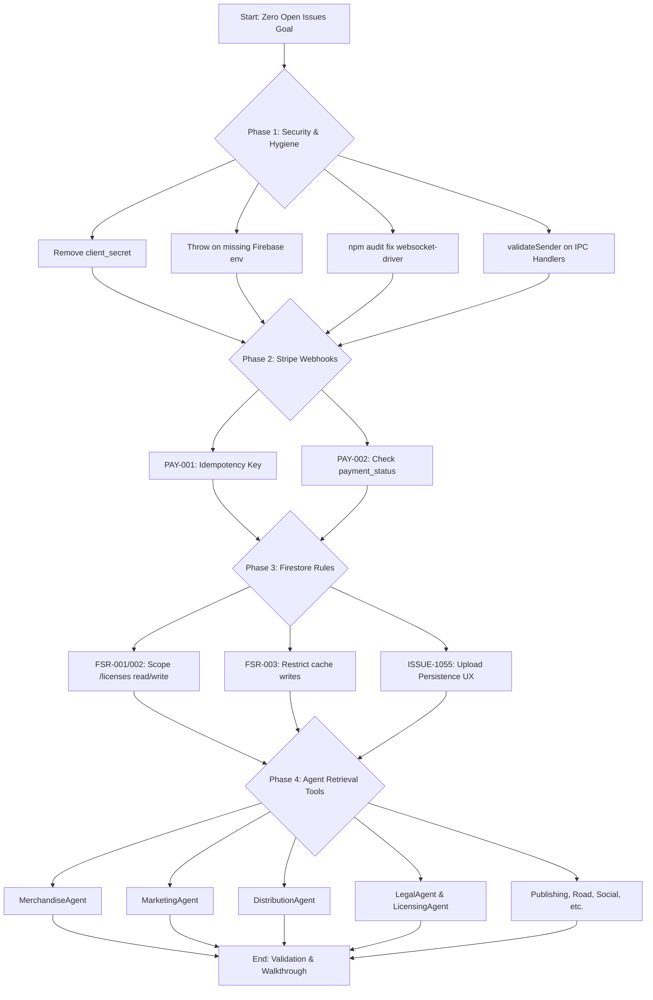

# Zero Open Issues Execution Strategy

This flowchart maps the high-level sequence of operations for closing out the remainder of `OPEN_ISSUES.md`.

### Explanation
This execution strategy is broken down into four distinct phases, executed sequentially to minimize regression risk. We start with the critical security and Node dependency tasks (Phase 1). Next, we patch financial risks in the Stripe webhooks (Phase 2). Then we lock down Firestore Rules and fix a silent persistence failure (Phase 3). Finally, we roll out the `DomainTools.ts` retrieval infrastructure across the remaining 14 agents (Phase 4). Once all phases are complete, we run the test suite and verify `OPEN_ISSUES.md` is empty of actionable items.
