# Zustand State Architecture Flowchart

This flowchart maps the **Zustand global store** architecture for **indii** — the centralized state management system that coordinates all 10 domain slices, inter-slice selectors, and the `useShallow` re-render boundary optimization.

```mermaid
graph TD
    %% Entry Point
    subgraph Root ["Root Store (packages/renderer/src/core/store/index.ts)"]
        Store["Zustand Store (combine() all slices)"]
        Listener["Store Listener (onChange callback)"]
    end

    %% Domain Slices
    subgraph Slices ["Domain State Slices (packages/renderer/src/core/store/slices/)"]
        AppSlice["appSlice (Module, Nav, UI State)"]
        AuthSlice["authSlice (User, Auth, Session)"]
        AgentSlice["agentSlice (Swarm Execution, Results)"]
        CreativeSlice["creativeSlice (Canvas, Designs, Drafts)"]
        DistributionSlice["distributionSlice (Releases, DDEX, Ingestion)"]
        FileSystemSlice["fileSystemSlice (Uploads, Assets, Queue)"]
        FinanceSlice["financeSlice (Billing, Payments, Ledger)"]
        ProfileSlice["profileSlice (User, Org, Settings)"]
        WorkflowSlice["workflowSlice (Automation, Nodes, Execution)"]
        AudioIntelligenceSlice["audioIntelligenceSlice (Analysis, Metadata)"]
    end

    %% Selector Boundaries
    subgraph Selectors ["Cross-Slice Selectors & Boundaries"]
        UserAuth["useAuth() → (user, token, org)"]
        ModuleState["useModule() → (activeModule, moduleState)"]
        CreativeContext["useCreativeContext() → (canvas, designs)"]
        DistroStatus["useDistroStatus() → (releases, status)"]
        AgentResults["useAgentResults() → (results, error)"]
    end

    %% Optimization Layer
    subgraph Optimization ["Re-render Optimization (useShallow)"]
        Shallow["useShallow(selector) — Prevents unnecessary renders"]
        Memoization["Zustand shallow equality check"]
        Bailout["Render bailout if shallow state unchanged"]
    end

    %% Integration Points
    subgraph Integration ["Integration Points"]
        ComponentsRead["React Components (useStore hook)"]
        AgentWrite["Agent Orchestration (store.setState)"]
        FirebaseSync["Firebase Sync (Firestore listeners)"]
        WebSocketSync["WebSocket Real-time (indiiREMOTE)"]
    end

    %% Transitions
    Store -->|"Initialization"| AppSlice
    Store --> AuthSlice
    Store --> AgentSlice
    Store --> CreativeSlice
    Store --> DistributionSlice
    Store --> FileSystemSlice
    Store --> FinanceSlice
    Store --> ProfileSlice
    Store --> WorkflowSlice
    Store --> AudioIntelligenceSlice

    AppSlice --> ModuleState
    AuthSlice --> UserAuth
    CreativeSlice --> CreativeContext
    DistributionSlice --> DistroStatus
    AgentSlice --> AgentResults

    UserAuth --> Shallow
    ModuleState --> Shallow
    CreativeContext --> Shallow
    DistroStatus --> Shallow
    AgentResults --> Shallow

    Shallow --> Memoization
    Memoization --> Bailout

    ComponentsRead -->|"Subscribe (useStore)"| Shallow
    AgentWrite -->|"setState()"| Store
    FirebaseSync -->|"Update slice"| Store
    WebSocketSync -->|"Update slice"| Store

    %% Styling
    style Store fill:#00D4FF,color:#000
    style Listener fill:#8A2BE2,color:#FFF

    style AppSlice fill:#39FF14,color:#000
    style AuthSlice fill:#39FF14,color:#000
    style AgentSlice fill:#39FF14,color:#000
    style CreativeSlice fill:#39FF14,color:#000
    style DistributionSlice fill:#39FF14,color:#000
    style FileSystemSlice fill:#39FF14,color:#000
    style FinanceSlice fill:#39FF14,color:#000
    style ProfileSlice fill:#39FF14,color:#000
    style WorkflowSlice fill:#39FF14,color:#000
    style AudioIntelligenceSlice fill:#39FF14,color:#000

    style UserAuth fill:#FF8C00,color:#000
    style ModuleState fill:#FF8C00,color:#000
    style CreativeContext fill:#FF8C00,color:#000
    style DistroStatus fill:#FF8C00,color:#000
    style AgentResults fill:#FF8C00,color:#000

    style Shallow fill:#FF00FF,color:#FFF
    style Memoization fill:#FF00FF,color:#FFF
    style Bailout fill:#FF00FF,color:#FFF
```

## Transition Breakdown

1. **Root Store Initialization:** The **Zustand Store** combines all 10 domain slices into a single immutable global state tree. Each slice is a separate module managing its own domain (auth, creative, finance, etc.).

2. **Domain Slices:**
   - **appSlice:** Current module, navigation state, UI panel visibility, theme
   - **authSlice:** Authenticated user, session token, organization, permissions
   - **agentSlice:** Active swarm execution state, agent results, error logs
   - **creativeSlice:** Canvas state, design drafts, AI generation prompts
   - **distributionSlice:** Release metadata, DDEX ingestion status, delivery timeline
   - **fileSystemSlice:** Asset uploads, queued operations, storage references
   - **financeSlice:** Subscription tier, billing period, payment methods, ledger
   - **profileSlice:** User profile, organization settings, preferences
   - **workflowSlice:** Automation nodes, execution history, trigger state
   - **audioIntelligenceSlice:** Audio analysis metadata, feature extraction results, BPM/key

3. **Cross-Slice Selectors:** Specialized selectors combine data from multiple slices to provide cohesive context to components. Example: `useModule()` combines current module ID from appSlice with module-specific state.

4. **Store Listener (onChange):** Any slice mutation triggers a global callback. This allows Firebase sync, WebSocket broadcast (for indiiREMOTE), and agent state updates to flow bidirectionally.

5. **useShallow Boundary:** Components subscribe to store slices using `useShallow(selector)`. Zustand performs shallow equality checking — if the selector output has the same reference (shallow equal), the component does NOT re-render. This prevents cascading re-renders when sibling slices change.

6. **Render Bailout:** If shallow equality passes, React skips the component render entirely. This is critical for performance — without shallow checks, a single field change in agentSlice would re-render the entire UI.

7. **Integration Points:**
   - **React Components** read via `useStore(selector)` hooks with `useShallow` protection.
   - **Agent Orchestration** writes via `store.setState({ agentSlice: { ... } })`.
   - **Firebase Sync** listens to Firestore and updates slices reactively.
   - **WebSocket (indiiREMOTE)** broadcasts state changes between desktop and mobile in real-time.

8. **Bidirectional Sync:** When a user changes state (e.g., uploading a file), the component calls `store.setState()`, which triggers Firebase sync AND WebSocket broadcast, ensuring all devices stay in sync.

## Key Implementation Notes

- **No Redux boilerplate:** Zustand is declarative and minimal — no actions, no dispatch, no reducers.
- **Slice isolation:** Each slice is responsible for its own invariants. No cross-slice mutations allowed within a slice.
- **Memoization strategy:** Use `useShallow` in every component that subscribes to a slice. Without it, every store mutation causes re-renders.
- **Selector reuse:** Define common selectors (like `useAuth()`) to avoid duplicating slice navigation in 100+ components.
