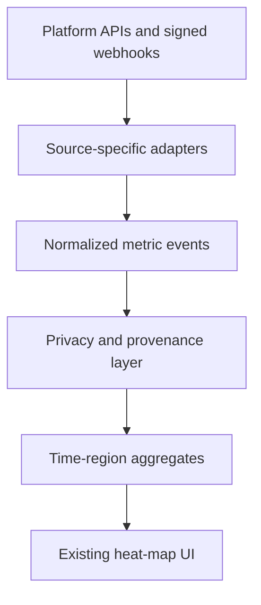

# Unified Audience Heat Map — Future Aggregation Contract

Status: architecture note; current heat-map UI intentionally unchanged.

## Purpose

The future heat map aggregates every legitimately available social, streaming, and video-play signal across connected platforms while keeping unlike measurements visibly separate. It answers where and when audience activity occurs without turning streams, Views, impressions, listeners, purchases, and engagement into one misleading total.

## Normalized event contract

Every event must retain:

| Field | Meaning |
| --- | --- |
| `ownerId` | Artist workspace owner |
| `platform` | Instagram, YouTube, Spotify, TikTok, or another verified source |
| `contentFormat` | Photo, carousel, Story, Reel, long video, stream, or commerce |
| `metric` | Views, plays, streams, listeners, reach, impressions, shares, saves, or purchases |
| `value` | Non-negative provider-reported number |
| `sourceMetric` | Exact provider field used |
| `sourceQuality` | Direct, legacy fallback, proxy, or unavailable |
| `occurredAt` | Source event or reporting-window time |
| `region` | Provider-authorized coarse region; never inferred from raw identifiers |

## Display rules

- Default to Unified Views for social content, but retain the original source field.
- Display streams, video plays, Views, unique listeners, reach, impressions, purchases, and revenue as separate layers.
- Allow comparison and correlation; never add unlike units into a universal audience number.
- Show proxy and unavailable labels in tooltips, exports, and agent context.
- Scheduling recommendations require sufficient regional activity data and an explicit reporting window.

## Privacy

- Aggregate before visualization and suppress cells that could expose one person's activity.
- Do not send customer IDs, usernames, message text, email addresses, or precise coordinates to the heat map.
- Store only provider-authorized regional granularity with retention and deletion tied to the owning workspace.
- Commerce identity remains in the protected CRM ingestion path; the heat map receives aggregated purchase counts or value only.

## Deferred implementation

No current heat-map component or persisted heat-map schema is changed by the Instagram alignment. Implementation begins only after source availability, geographic granularity, retention, minimum-cell thresholds, and migration behavior are approved for every adapter.
